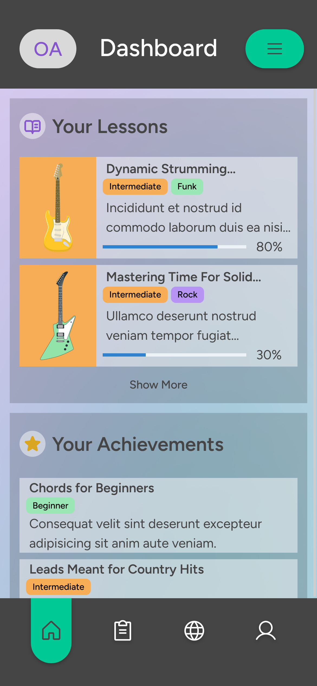

<!-- PROJECT LOGO -->

 

  

  <h3 align="center">SEUS - Online Guitar Lessons</h3>

  

    A mobile web app created with React
     
    <a href="https://github.com/othneildrew/Best-README-Template"><strong>View Demo »</strong></a>
  

<!-- ABOUT THE PROJECT -->

## About The Project

SEUS is a mockup mobile web app created using React, Chakra UI and Firebase. This application is focussed on providing guitar lessons tailored to the user's preferences. After signing up and completing the introduction section, the user is able to browse the available lessons which are categorized based on level and style.

### Built With

[![React][React.js]][React-url]
[![ChakraUI][ChakraUI]][ChakraUI-url]
[![Firebase][Firebase]][Firebase-url]

 

Copyright &copy; 2023 Ocean Abernathy All Rights Reserved.

<!-- MARKDOWN LINKS & IMAGES -->

[product-screenshot]: src/images/product-screenshot.png
[React.js]: https://img.shields.io/badge/React-20232A?style=for-the-badge&logo=react&logoColor=61DAFB
[React-url]: https://reactjs.org/
[ChakraUI]: https://img.shields.io/badge/chakra-%234ED1C5.svg?style=for-the-badge&logo=chakraui&logoColor=white
[ChakraUI-url]: https://chakra-ui.com/
[Firebase]: https://img.shields.io/badge/firebase-%23039BE5.svg?style=for-the-badge&logo=firebase
[Firebase-url]: https://firebase.google.com/
